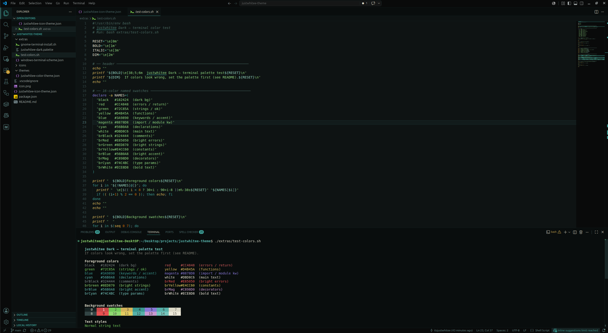

# justwhitee Dark

A handcrafted VS Code dark theme with petrol/cyan accents, warm readable text, and a full matching terminal palette. Inspired by Gruvbox but more saturated and colorful.



---

## Installation

**From the Marketplace** (recommended):
1. Open VS Code
2. `Ctrl+Shift+X` → search **justwhitee Dark**
3. Click **Install**

**Activate the theme:**
- `Ctrl+Shift+P` → **Preferences: Color Theme** → `justwhitee Dark`
- For icons: **Preferences: File Icon Theme** → `justwhitee Icons`

**From a `.vsix` file:**
```bash
code --install-extension justwhitee-theme-x.x.x.vsix
```
Or go to **Extensions → ⋯ → Install from VSIX…**

---

## What's included

- **Color theme** — `justwhitee Dark` with carefully chosen syntax colors across all major languages
- **Icon theme** — `justwhitee Icons` with a matching file/folder icon set
- **Terminal palette** — matching ANSI 16-color palette for VS Code's integrated terminal, Ptyxis, and Windows Terminal

---

## Color reference

| Role | Hex |
|---|---|
| Background | `#0e1313` |
| Main text | `#dbd8c6` |
| Comments | `#486860` |
| Strings | `#8acc7c` |
| Template / interpolated strings | `#5cc4a8` |
| Numbers | `#ca6702` |
| Constants / booleans / null | `#e4cc60` |
| Function names | `#e0b44a` |
| Built-in functions | `#d4985a` |
| Control flow (`if` / `for` / `while`) | `#3a9890` |
| Declarations (`var` / `let` / `fn`) | `#56b0a8` |
| Type-def keywords (`class` / `enum`) | `#3a9890` |
| Import keywords (`import` / `from`) | `#8878d8` |
| Exit / jump (`return` / `raise`) | `#dd2d4a` |
| Class / type / interface names | `#c04878` |
| Enum names | `#d4a030` |
| Type parameters `<T>` | `#94d2bd` |
| Namespace / module names | `#8cccc0` |
| Parameters | `#c8b890` |
| Properties / fields | `#8ecab8` |
| Decorators / annotations | `#c47888` |

---

## Terminal palette

The theme ships with matching terminal colors for the VS Code integrated terminal, Ptyxis, and Windows Terminal.

| # | Name | Hex |
|---|---|---|
| 0 | Black | `#182424` |
| 1 | Red | `#cc4848` |
| 2 | Green | `#72c85a` |
| 3 | Yellow | `#d4b45a` |
| 4 | Blue | `#3a9890` |
| 5 | Magenta | `#8878d8` |
| 6 | Cyan | `#56b0a8` |
| 7 | White | `#dbd8c6` |
| 8 | Bright Black | `#324444` |
| 9 | Bright Red | `#e85050` |
| 10 | Bright Green | `#8ed870` |
| 11 | Bright Yellow | `#e4cc60` |
| 12 | Bright Blue | `#56b0a8` |
| 13 | Bright Magenta | `#c898d0` |
| 14 | Bright Cyan | `#74c4bc` |
| 15 | Bright White | `#ece8d8` |

### Ptyxis (Ubuntu 24.04+)

```bash
ptyxis --import-palette extras/justwhitee-dark.palette
```

Restart Ptyxis → right-click → **Preferences** → your profile → **Palette** → select **justwhitee Dark**.

### Windows Terminal

Open settings (`Ctrl+,` → **Open JSON file**) and merge the contents of `extras/windows-terminal-scheme.json` into the `"schemes"` array, then set it on your profile:

```json
"colorScheme": "justwhitee Dark"
```

### Test the colors

```bash
bash extras/test-colors.sh
```

Prints all 16 ANSI colors, text styles, and a simulated code snippet so you can verify the palette at a glance.

---

## Building from source

```bash
npm install -g @vscode/vsce
vsce package   # produces justwhitee-theme-x.x.x.vsix
```

> **Settings Sync note:** Sync uploads your settings (including the active theme name) but not local extension files. Install the `.vsix` manually on each machine, or use the Marketplace version so Sync picks it up automatically.

---

## License

[MIT](LICENSE.md)
